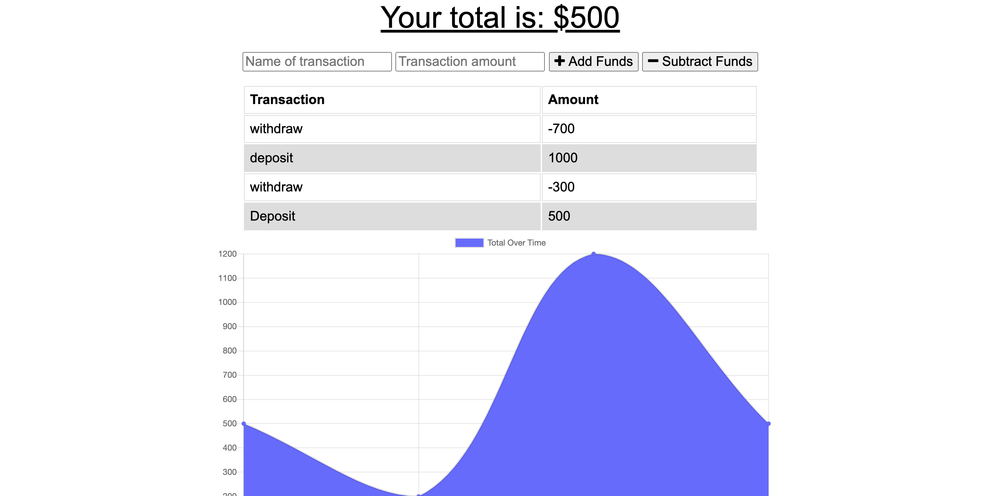

# Budget Tracker

This application allows a user to keep track of their transactions and creates a visual representation in the form of a graph.
 
 
App Link: https://dry-meadow-67535.herokuapp.com/

## Installation
The software used to create this generator include: Axios, dotenv, Express, Node, and Mongoose.

**Please use 'npm init -y' followed by npm-i to install the NPM dependencies. Upon installation, confirm that all the packages were installed and appear in your package.json file.**
 
  
If the dependencies listed above did not appear in your package.json file after running npm init-i, please run the following commands:
 
&nbsp;&nbsp;&nbsp;&nbsp;&nbsp;&nbsp;MONGO: npm i mongoose
 
&nbsp;&nbsp;&nbsp;&nbsp;&nbsp;&nbsp;AXIOS: npm i axios
 
&nbsp;&nbsp;&nbsp;&nbsp;&nbsp;&nbsp;ENV: npm i dotenv
 
&nbsp;&nbsp;&nbsp;&nbsp;&nbsp;&nbsp;EXPRESS: npm i express
 

## Usage
Budget Tracker helps the user keep track of their finances.

The user first types in a name for the transaction and then the amount of money involved. The user then chooses whether the transaction adds funds or subtracts funds and when completed, the transaction is charted on the graph. 

The app also has functionality to make it continue to work even when the user loses internet connection so they can keep track of their money no matter where they are.

## Screenshot

